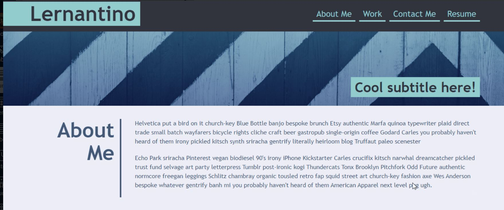
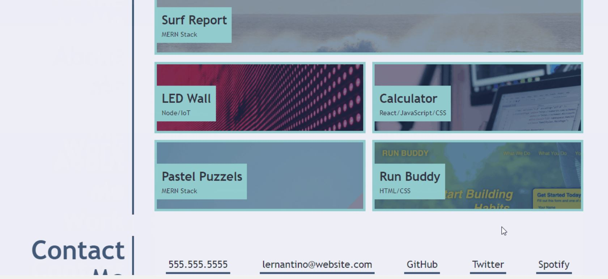
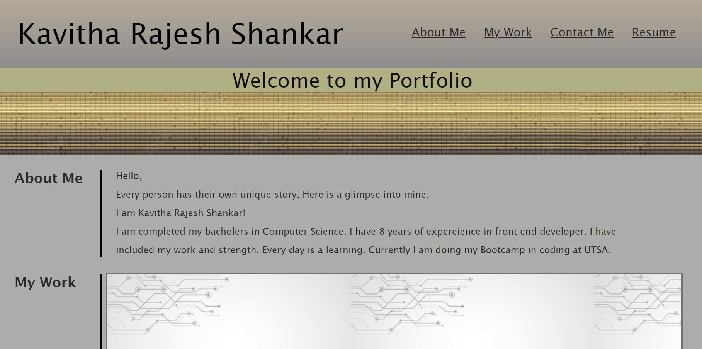
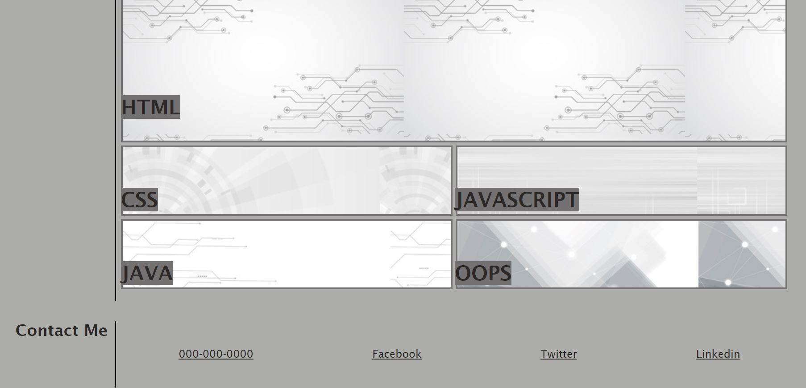

# Professional-Portfolio
For this week challenge we build a porfolio page which showcase our skills and talents to employers to fill a part time or full time position.

An effective portfolio highlights your strongest work as well as the thought processes behind it. Students who have portfolios with deployed web applications (meaning they are live on the web) are typically very successful in their career search after the boot camp. This last point can't be stressed enough: having several deployed projects is a minimum requirement to receive an initial interview at many companies.

With these points in mind, in this Challenge you'll set yourself up for future success by applying the core skills you've recently learned: flexbox, media queries, and CSS variables. You'll get to practice your new skills while creating something that you'll use during your job search. It's a win-win that you'll likely be grateful for in the future!

Let's look at what a user story written from the perspective of a hiring manager might look like. As you might remember, we follow the AS AN / I WANT / SO THAT format.

USER STORY - 
AS AN employer
I WANT to view a potential employee's deployed portfolio of work samples
SO THAT I can review samples of their work and assess whether they're a good candidate for an open position

Acceptance Criteria -
GIVEN I need to sample a potential employee's previous work
WHEN I load their portfolio
THEN I am presented with the developer's name, a recent photo or avatar, and links to sections about them, their work, and how to contact them
WHEN I click one of the links in the navigation
THEN the UI scrolls to the corresponding section
WHEN I click on the link to the section about their work
THEN the UI scrolls to a section with titled images of the developer's applications
WHEN I am presented with the developer's first application
THEN that application's image should be larger in size than the others
WHEN I click on the images of the applications
THEN I am taken to that deployed application
WHEN I resize the page or view the site on various screens and devices
THEN I am presented with a responsive layout that adapts to my viewport

Mock-Up -

The following animation shows the web application's appearance and functionality:

1. My personal portofolio is created from the scratch with my name, navigation bar with links. I have picked different color,font-family, font-size. And also used flexbox,media query.

2. All the links in the portfolio page is working and whenever I click on the section it take to the corresponding section inside the page. 

3. When mouse hover on the sections its glows and I have used mouse hover style property. 

4. For my applications I have given html, css, javascript, java and oops sections. 

5. When I press my work on the navigation link the UI scrolls to the mywork section.

6. And my first application is larger in size then the other images of the application. 

7. For the responsive layout I have given if the page reached 900px. The sections and items on my page wrap them by using the styles I have given inside the media query. 

Below is my deployed page -
https://kaviambi.github.io/Professional-Portfolio/

Here is the screenshot of my portfolio page - 

